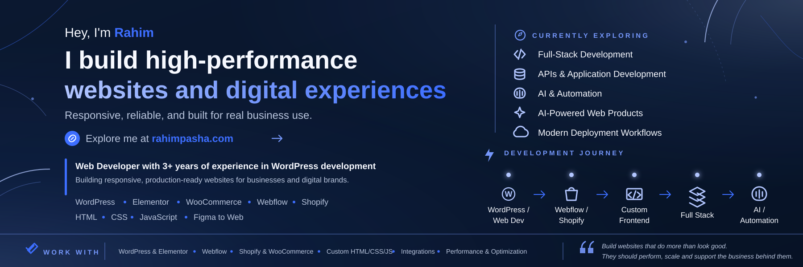

  

---

### Hey, I'm Rahim 👋

I build **high-performance websites and digital experiences** that are responsive, reliable and built for real business use.

Explore me at

---

### 🧭 About

I'm a **Web Developer with 3+ years of experience in WordPress development**, building responsive and production-ready websites for businesses and digital brands.

My work spans **WordPress, Elementor, WooCommerce, Webflow and Shopify**, alongside custom frontend development using **HTML, CSS and JavaScript**. I also translate Figma designs into accurate, responsive web experiences.

I'm currently expanding into **Full-Stack Development, AI and Automation**, moving from traditional web development toward smarter products, applications and automated workflows.

**My path**

`WordPress / Web Dev` **→** `Webflow / Shopify` **→** `Custom Frontend` **→** `Full Stack` **→** `AI / Automation`

Core experience &nbsp;•&nbsp; Production work &nbsp;•&nbsp; Hands-on development &nbsp;•&nbsp; Learning &nbsp;•&nbsp; Exploring

 

---

### 🔭 Currently Exploring

- ⚙️ **Full-Stack Development**
- 🔌 **APIs & Application Development**
- 🤖 **AI & Automation**
- 🧠 **AI-Powered Web Products**
- 🚀 **Modern Deployment Workflows**

---

### 🛠️ Tech Stack

**Web / CMS**

**Frontend**

**Design & Workflow**

**Currently Learning**

---

### ⚡ What I Work With

- 💻 WordPress & Elementor Development
- 🌐 Webflow Development
- 🛒 Shopify & WooCommerce
- 🧩 Custom HTML, CSS & JavaScript
- 🎨 Figma to Web Development
- 🔌 Third-Party Integrations
- 🚀 Website Performance & Optimization
- 🤖 AI & Web Automation Workflows

---

### 💡 Development Approach

> **Build websites that do more than look good. They should perform, scale and support the business behind them.**

I focus on responsive implementation, maintainable development, performance and reliable real-world execution.

---

  <strong>Web Development • eCommerce • Full Stack • AI & Automation</strong>

  <a href="https://rahimpasha.com/">Portfolio</a>
  &nbsp;•&nbsp;
  <a href="https://www.linkedin.com/in/rahim-pasha/">LinkedIn</a>
  &nbsp;•&nbsp;
  <a href="https://github.com/rahimpashadev">GitHub</a>

